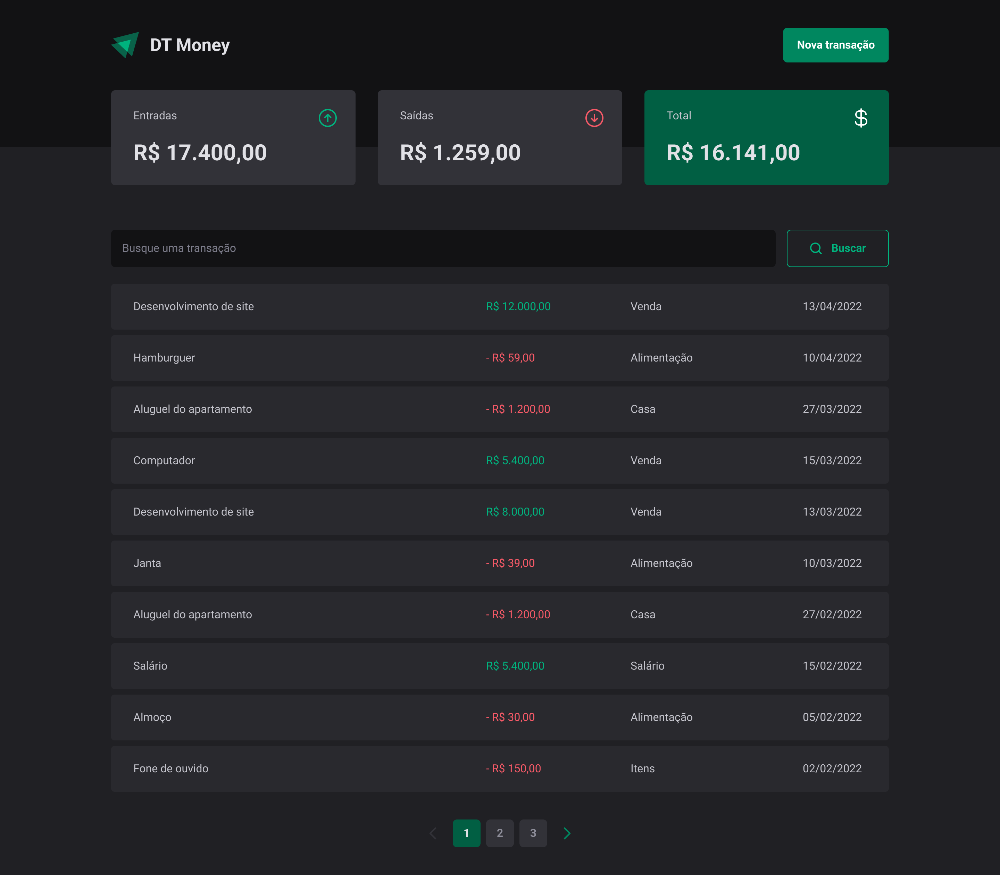
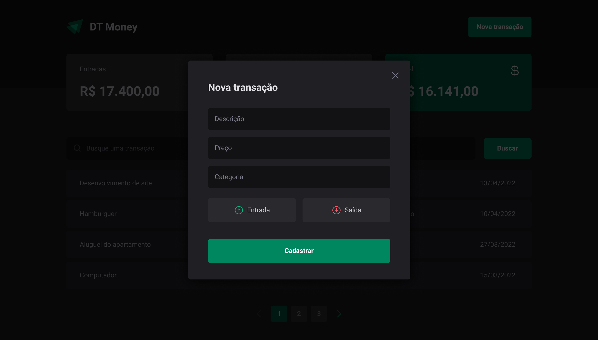

## Finance

  
  

O Finance é uma aplicação simples de controle financeiro, onde você pode cadastrar suas entradas e saídas, e ver o saldo total.
Além disso, você pode gerenciar suas transações, em categorias, o que facilita a visualização do seu dinheiro.

### 🛠️ Nesse projeto foi utilizado

- Vite
- Typescript
- React
- PhosphorIcons
- Context API
- Axios
- Styled Components
- React Hook Form

 

## 🚧 Layout

## :memo: Licença

Esse projeto está sob a licença MIT. Veja o arquivo [LICENSE](.github/LICENSE) para mais detalhes.

---

Feito com ♥ by JulioAmaral007

&nbsp;
